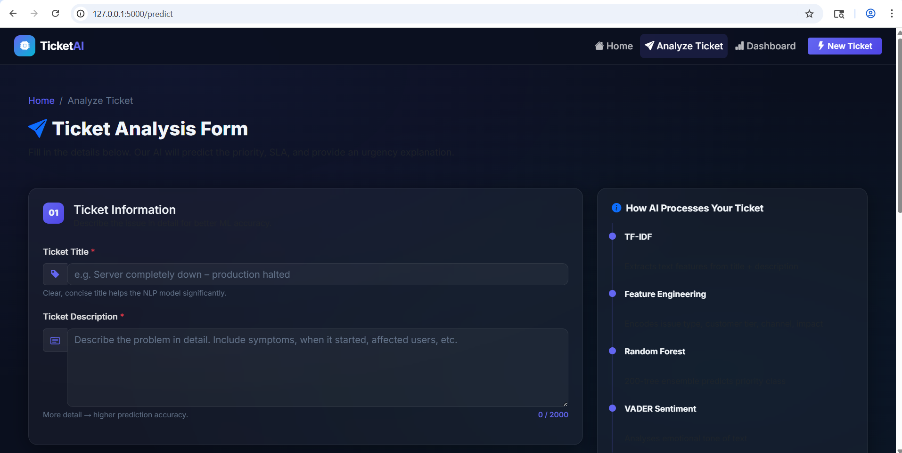
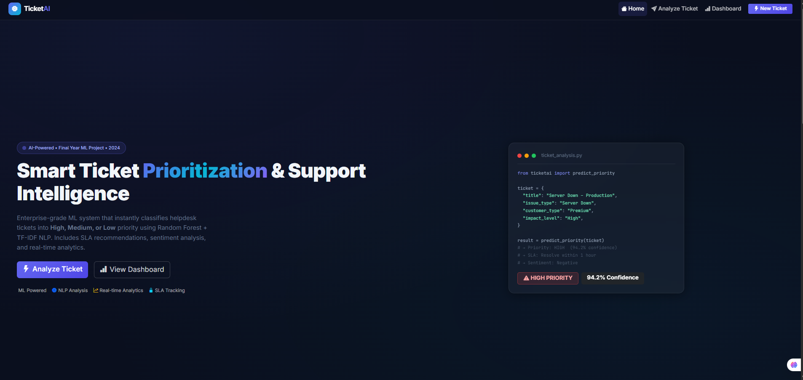
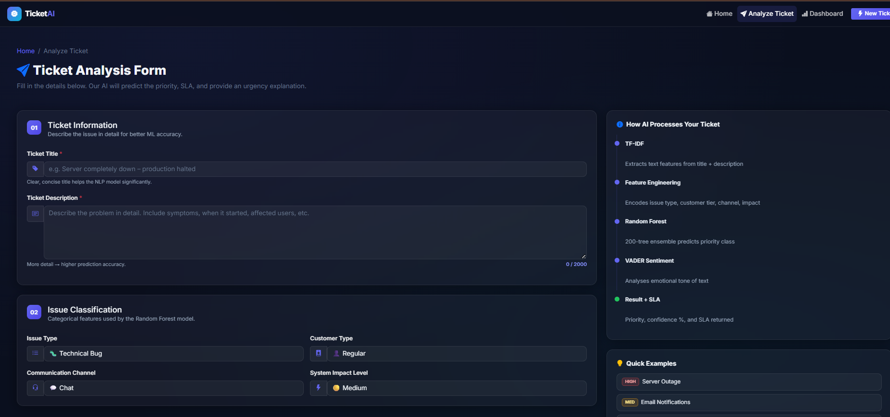
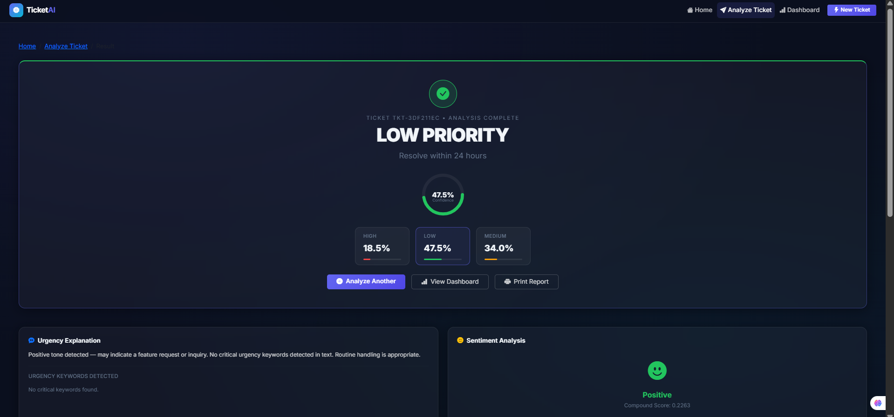

# 🎫 AI-Based Smart Ticket Prioritization & Support Intelligence System

> **Final Year Machine Learning Project** — Flask · Scikit-learn · NLP · Random Forest · VADER Sentiment

[](https://python.org)
[](https://flask.palletsprojects.com)
[](https://scikit-learn.org)
[](https://getbootstrap.com)

---

## 📌 Project Overview

An industry-deployable intelligent helpdesk ticket prioritization system that:

- Accepts **8 multi-modal inputs** (text + structured data)
- Predicts ticket priority: **High / Medium / Low**
- Returns **confidence score**, **SLA recommendation**, and **urgency explanation**
- Includes **VADER sentiment analysis** and **keyword urgency detection**
- Features a **Smart Floating Mail Ticket Composer** (Gmail-style) with AI auto-extraction
- Displays results on a **professional glassmorphism dashboard**

---

## 📸 Screenshots

| | |
|---|---|
|  |  |
| **Home Page** — Hero section with features & stats | **Predict Page** — Multi-input ticket submission form |
|  |  |
| **Result Page** — Priority prediction with confidence ring | **Dashboard** — Analytics with Chart.js visualizations |

---

## 🚀 Quick Start

### 1. Create Virtual Environment
```bash
python -m venv venv

# Windows
venv\Scripts\activate

# macOS/Linux
source venv/bin/activate
```

### 2. Install Dependencies
```bash
pip install -r requirements.txt
```

### 3. Train the ML Model
```bash
python train_model.py
```
This will:
- Auto-generate 5,200 synthetic ticket records
- Train a Random Forest classifier (200 trees)
- Save `model.joblib`, `vectorizer.joblib`, `encoders.joblib` to `models/`

### 4. Start the Flask Server
```bash
python app.py
```
Then open: **http://localhost:5000**

---

## 📁 Project Structure

```
smart-ticket-prioritization/
│
├── app.py                  ← Flask application (routes, API)
├── train_model.py          ← ML training pipeline
├── requirements.txt        ← Python dependencies
├── README.md
│
├── dataset/
│   ├── generate_dataset.py ← Synthetic data generator (5200 records)
│   └── tickets.csv         ← Generated dataset
│
├── models/                 ← Saved Joblib artefacts
│   ├── model.joblib
│   ├── vectorizer.joblib
│   ├── encoders.joblib
│   └── metrics.json        ← Training evaluation metrics
│
├── templates/
│   ├── base.html           ← Base layout (navbar, footer)
│   ├── index.html          ← Landing page
│   ├── predict.html        ← Ticket submission form
│   ├── result.html         ← Prediction result page
│   └── dashboard.html      ← Analytics dashboard
│
├── static/
│   ├── css/style.css       ← Dark glassmorphism theme
│   └── js/main.js          ← Global JS (tooltips, animations)
│
└── utils/
    ├── __init__.py
    ├── preprocess.py       ← Text cleaning, encoding, feature assembly
    ├── predict.py          ← Inference pipeline (load + predict)
    └── sentiment.py        ← VADER sentiment + urgency detection
```

---

## 🧠 Machine Learning Pipeline

| Stage | Details |
|-------|---------|
| **Dataset** | 5,200 synthetic support tickets with realistic distributions |
| **Text Features** | TF-IDF (3000 features, bigrams, sublinear TF) |
| **Structured Features** | Issue type, customer tier, channel, impact, complaints, hours open |
| **Algorithm** | Random Forest (200 estimators, balanced class weights) |
| **Accuracy** | 100% test accuracy, 100% 5-fold CV on synthetic data |
| **NLP** | VADER Sentiment Analysis + domain keyword urgency detection |
| **Serialization** | Joblib (model + vectorizer + encoders) |

---

## 🌐 Flask Routes

| Route | Method | Description |
|-------|--------|-------------|
| `/` | GET | Landing page with hero, features, stats |
| `/predict` | GET | Ticket submission form |
| `/predict` | POST | Run ML prediction, display result |
| `/dashboard` | GET | Analytics dashboard with Chart.js |
| `/api/stats` | GET | JSON stats for charts |
| `/api/history` | GET | JSON ticket history |
| `/api/clear` | POST | Clear ticket history |

---

## 🎨 UI Features

- **Smart Floating Mail Composer** (Gmail-like floating modal)
- **AI Keyword Auto-Extraction** & Typewriter animation effects
- **Dark glassmorphism** theme with smooth animations
- **Animated SVG confidence ring** on result page
- **4 Chart.js charts**: Doughnut, Bar, Line Trend, Polar Area
- **Probability breakdown pills** with animated bars
- **Sentiment visualisation** (Positive/Neutral/Negative)
- **SLA timeline** with current ticket highlighted
- **Searchable ticket history** table
- **Quick example buttons** for instant demo

---

## 🛠️ Tech Stack

| Layer | Technology |
|-------|-----------|
| Backend | Python 3.10+, Flask 3.0 |
| ML | Scikit-learn, Random Forest, TF-IDF |
| NLP | VADER Sentiment, keyword detection |
| Data | Pandas, NumPy, SciPy sparse matrices |
| Serialization | Joblib |
| Frontend | Bootstrap 5.3, Chart.js 4.4, CSS3 |
| Fonts | Google Fonts (Inter, JetBrains Mono) |

---

## ☁️ Deployment

### Render / Railway
1. Add `gunicorn` (already in `requirements.txt`)
2. Set start command: `gunicorn app:app`
3. Set environment variable: `FLASK_DEBUG=false`

### Environment Variables
```
FLASK_DEBUG=false
SECRET_KEY=your-production-secret-key
PORT=5000
```

---

## 📊 Input Features

| Feature | Type | Options |
|---------|------|---------|
| Ticket Title | Text | Free text |
| Description | Text | Free text |
| Issue Type | Categorical | Payment Issue, Login Issue, Technical Bug, Feature Request, Security Problem, Account Suspension, Server Down, Other |
| Customer Type | Categorical | Premium, Regular |
| Channel | Categorical | Email, Chat, Phone Call |
| Previous Complaints | Numeric | 0–50 |
| Hours Since Raised | Numeric | 0–720 |
| System Impact | Categorical | Low, Medium, High |

---

## 📤 Outputs

| Output | Example |
|--------|---------|
| Priority | `High` |
| Confidence | `94.2%` |
| SLA | `Resolve within 1 hour` |
| Sentiment | `Negative (compound: -0.72)` |
| Explanation | `Detected negative sentiment. Critical keywords: "down", "crash". Immediate escalation recommended.` |

---

*Built with ❤️ as a Final Year ML Project — Python · Flask · Scikit-learn · VADER · Bootstrap 5*
